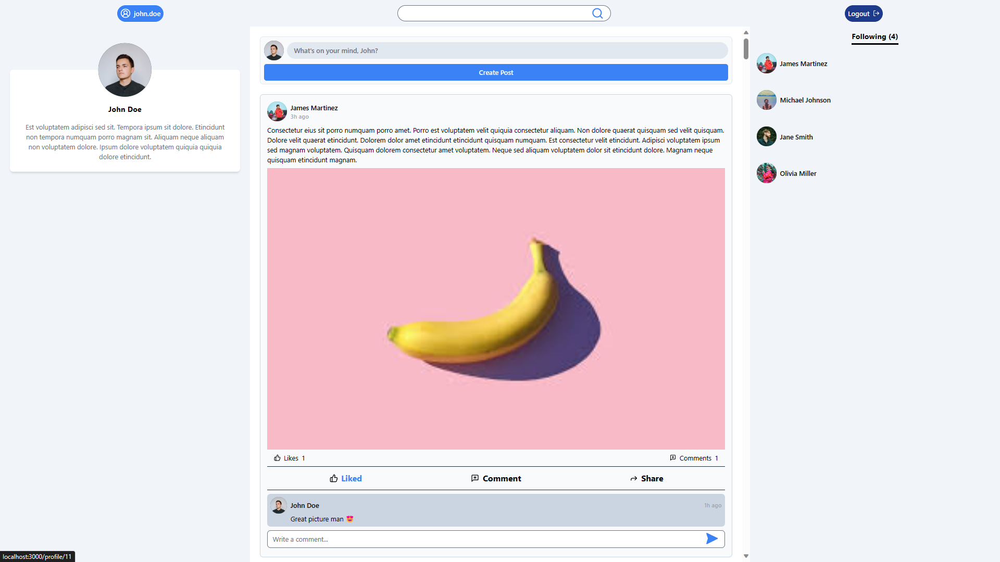

<div align='center'><h1>Django Social Media App</h1></div>


<!-- <div align='center'><h3><a href="https://vehicle-tracking-rush1dan.vercel.app" target="_blank">View Live Demo</a></h3></div> -->

## About
This is a full stack modern social media app built with **Django** as the backend, **PostgreSQL** as the database and **Next.js** with **React**, **TypeScript** and **TailwindCSS** on the frontend. The backend comprises of necessary API endpoints built with the **Django REST framework**. The application securely handles user authentication and session management with the help of **Simple JWT**. The application was built from the start through a seamless **Dockerized** development workflow where the whole backend (Django + Postgres containers) was setup with a single **Docker Compose** command and ready to work.

## Features
- User authentication and session management with JWT
- Filtered user search
- Intuitively filtered news feed content
- View/Edit Profile with profile image
- Follow/Unfollow users
- Create posts with or without images
- Like posts
- Comment on posts
- Demo accounts to test out the app

## Dev

First, run the development servers for the server and client apps:

For the server app, cd into the server directory and:
```bash
docker compose up
```
For the client app, cd into the client directory and:
```bash
npm run dev
# or
yarn dev
# or
pnpm dev
```

Open [http://localhost:3000](http://localhost:3000) with your browser to use the started application.

<!-- ## Demo
[](https://www.youtube.com/watch?v=IUBV-C7MmDs) -->

## Built With
<div>
<h4>Front End:</h4>

<div>


</div>

<h4>Back End:</h4>

<div>


</div>

</div>